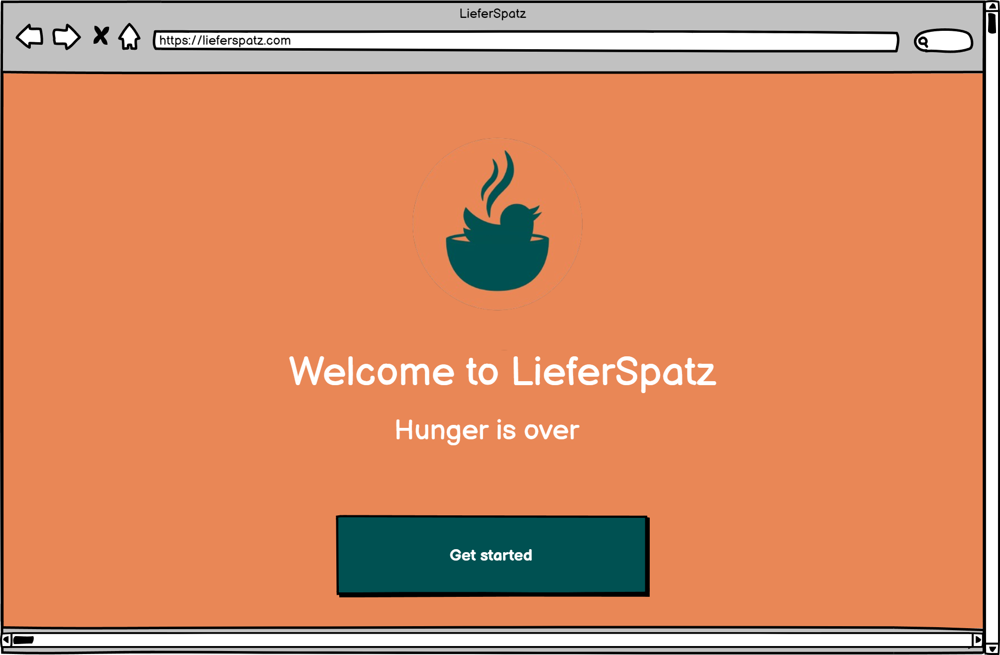

# Lieferspatz

## Project Overview
Lieferspatz is a simplified online food and beverage delivery platform inspired by services like Lieferando and Wolt. The platform allows users to order food from various nearby restaurants, with functionalities for restaurant registration, menu management, order processing, and viewing order status.

## Features
- **Restaurant Registration**: Restaurants can sign up, manage their menu, set delivery zones (by postal code), and update operating hours.
- **Customer Interaction**: Customers can browse available restaurants, view menus, place orders, and track order statuses.
- **Order Management**: Restaurants can accept or reject orders, track order history, and manage ongoing and completed orders.
- **SQLite Database**: Handles restaurant, customer, and order information with efficient data management.


## How to Run the Project

### Prerequisites
- Python 3.x
- Flask
- SQLite 3.44.0

### Setup
1. Clone the repository:
    ```bash
    git clone https://github.com/your-username/Lieferspatz.git
    ```

2. Install the required dependencies:
    ```bash
    pip install -r requirements.txt
    ```

3. Set up the SQLite database by using the provided SQL file:
    ```bash
    sqlite3 Project-FinalDB.db < Project-FinalDB.sql
    ```

4. Run the Flask server:
    ```bash
    python main.py
    ```

5. Access the application in your web browser at:
    ```
    http://127.0.0.1:5000
    ```

## Usage
1. **For Restaurants**:
    - Register an account with the restaurant's name, address, and operating hours.
    - Add, edit, or delete items from the menu.
    - Manage incoming orders, accept or reject orders, and view order history.
    
2. **For Customers**:
    - Create an account with name, address, and postal code.
    - Browse restaurants that deliver to your postal code.
    - Place an order and track its status from "in preparation" to "completed".

## Project Details
- **Backend**: Flask, Python, SQLite
- **Frontend**: HTML, CSS, JavaScript
- **Database**: SQLite 3.44.0

## Contributors
- Mohammad KANDAKJI
- Mohamed Abdelbar
- Omar Kotb
- Moamen Hatem

## License
This project is licensed under the MIT License - see the [LICENSE](LICENSE) file for details.

